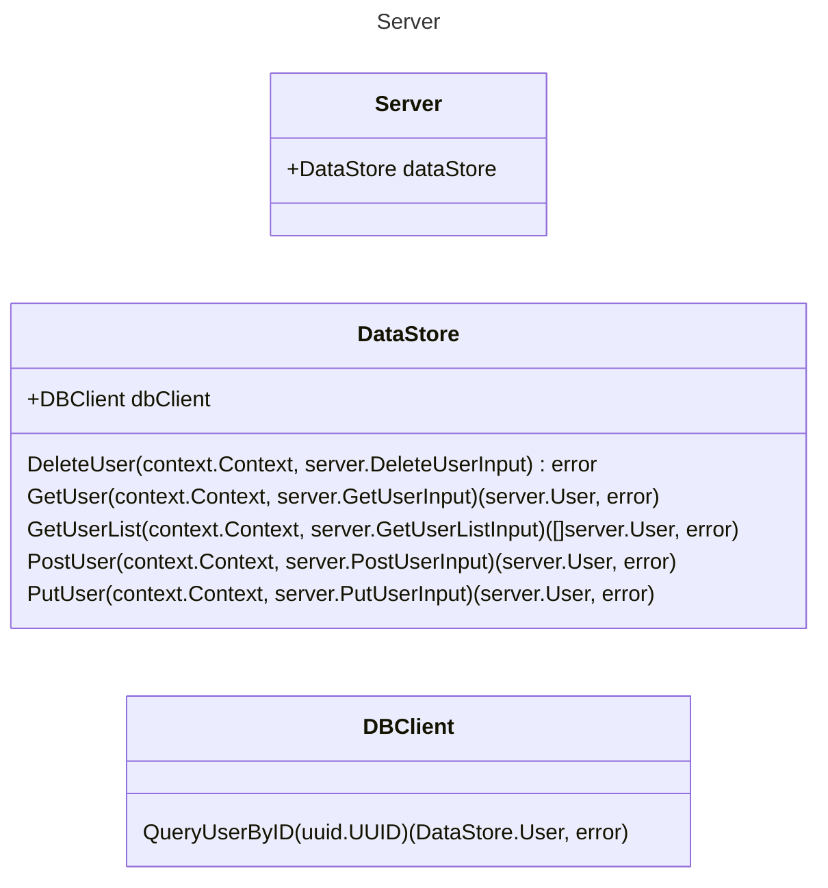

# job-board API

This is a demonstration of a HTTP REST API written in Go. It is a recreation of a system in which
multiple interfaces are implemented to serve uniform data from various data sources.

## Project structure

### Code Structure

The `main.go` file sets up dependencies and starts the server, listening on port 8080. The [server](./server/)
package is the central package that handles all the client interactions via REST API. The dependencies are implemented as shown in this graph.

### OpenAPI

The OpenAPI spec is in [openapi.yaml](./openapi.yaml), and should be kept up to date with any changes made to the API.
